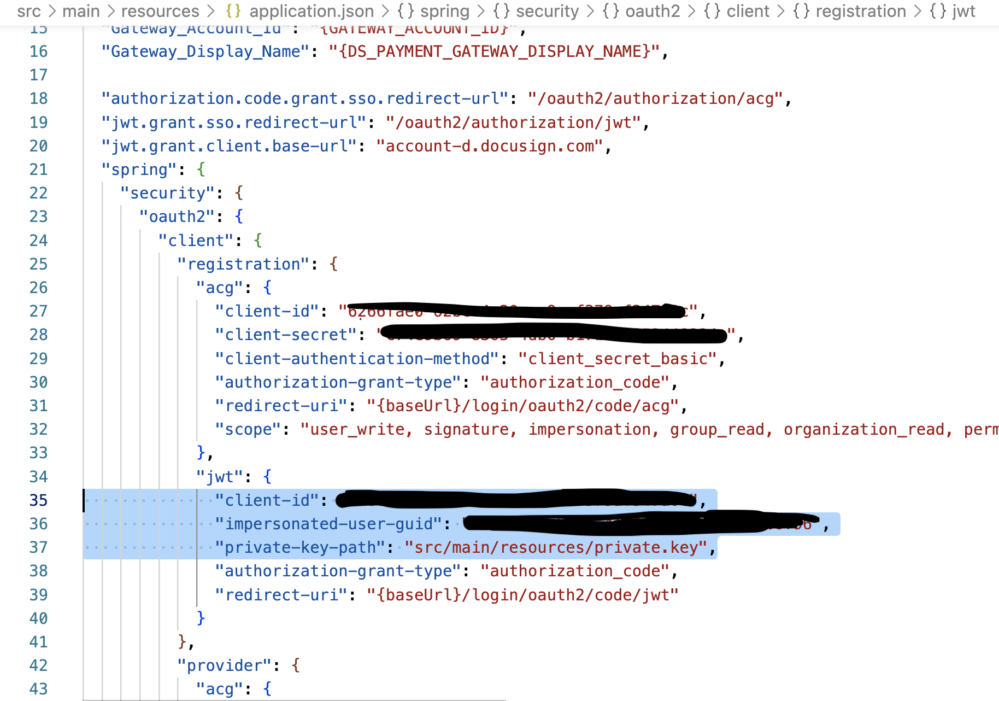

# Getting Started

## setup docusign 
  1. go to https://developers.docusign.com and create an account
  2. go to Quickstart https://developers.docusign.com/docs/esign-rest-api/quickstart/ 
  3. create an application and let docusign create a demo project for you
  4. Docusign will create all needed resources to access this application for you
  5. the generated demo project contains an application.json file
  6. copy the values of the properties


      ```spring.security.oauth2.client.registration.jwt.client-id```

      and 

      ```spring.security.oauth2.client.registration.jwt.guid``` 

      to your application.properties

      ```docuSign.clientId```

      ```docuSign.userId```

   and copy the private.key to src/main/resources/docusign_private.key



  7. create a SaaS cluster with 8.3.0-alpha4
  8. create a new client in SaaS and copy the config params to application.properties
  9. create a secret SENDGRID_DEMO and pass by the sendgrid api key for the Consulting team (see Keeper via Okta)
  10. copy the process model to a web-modeler project
  11. deploy the process model from within the web-modeler (to activate the webhook)
  12. click the webhook connector and go to tab webhood
  13. copy the webhook-url
  14. go to docusign https://admindemo.docusign.com/apps-and-keys
  15. select on the left menu "Connect"
  16. add a new configuration ("custom")
  17. give it a name and paste the webhook url
  18. under trigger events select Envelope and recipients and click "Envelope signed/completed"
  19. start the application (do a mvn clean package first)
  20. go to http://localhost:8080/start
  21. you can choose example images to upload from demo-images (The Simpsons)
  22. the email provided for the "request" is being used to send a signature request, whereas the managers email in the userTask will receive the confirmation and the signed document.

